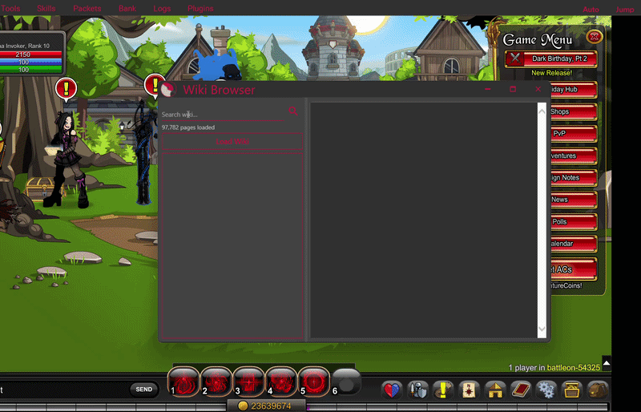

<div align="center">


## [Usage](./usage.md) | [Contributors](#contributors) | [Build Guide](./BUILD.md) | [Support](#skua-developers)

</div>

### About Skua

Skua is the successor to [RBot](https://github.com/rodit/RBot) (originally made by "[rodit](https://github.com/rodit)"), now remade and rebranded by [BrenoHenrike](https://github.com/BrenoHenrike/), with the help of [Lord Exelot](https://github.com/BrenoHenrike/), and a handful of scripters. It is a third-party client made by the people mentioned above. It also has many "features" and quirks. Overall, it will make this glorified flash game on steroids a piece of cake.

---

### What's New (Enviiious)

This fork extends Skua with three major additions built on top of the core codebase.

#### Outfit Changer

A full wardrobe system integrated into CoreBots Options. Allows you to save and switch between complete outfit loadouts (armor, helm, cape, weapon) directly from the CBO panel. Supports both Outfit Mode (save full wardrobe sets) and Classic Mode (per-slot item selection). Loadouts persist across sessions.

#### Plugin Suite *(in progress)*

A suite of plugins that run alongside any bot script to provide bot scheduling (when one bot completes another will begin), and HUD overlays and more.

#### AQW Wiki Query Engine

A fully functional wiki query engine integrated into Skua core and accessible from any script or plugin as `Bot.Wiki`. Powered by a locally stored JSON snapshot of the AQW wiki.

**Available queries:**

```csharp
Bot.Wiki.IsLoaded                              // check if wiki is ready
Bot.Wiki.Search("query", limit)                // full-text search
Bot.Wiki.GetEnhancement("Acheron")             // enhancement page
Bot.Wiki.GetEnhancementEffects("Acheron")      // special skill bullet points
Bot.Wiki.FindDropSource("Enchanted Scale")     // monster + map for any item
Bot.Wiki.GetMonsterLocations("Tempest Dracolich")
Bot.Wiki.GetMonsterDrops("Tempest Dracolich")
Bot.Wiki.GetItem("Dragonslayer General")
Bot.Wiki.GetItemSource("Dragonslayer General")
Bot.Wiki.GetQuest("DragonSlayer Farming Quest")
Bot.Wiki.GetBySlug("tempest-dracolich")
Bot.Wiki.GetByTag("monster")
```



> For wiki setup assistance, contact **Enviiious** on Discord: **@diversillect**
---

### Do we store information online?

The *only* things that get recorded are: the auto-generated number **(not your actual game user ID)** to identify you, the number of scripts run (stopped & started), and the start and stop timestamps. This can be completely opted out of when first running a script, or you can edit the text file ***"DataCollectionSettings"*** in your `Documents\Skua > DataCollectionSettings.txt`. If you make it look as shown below, it will send absolutely nothing 👍

```txt
UserID: null
genericDataConsent: false
scriptNameConsent: false
stopTimeConsent: false
```

### What do we use this data for?

To keep track of what bots are run, how often, how long, and just how popular some bots are.

### For Account Manager

Your **Account Info** will be stored only in your **appdata** and never shown anywhere, nor in a text file. We **DO NOT** store it online because we intended to make an account manager with **no database**.

### Some examples of the types of scripts Skua has

- **Story scripts** found in the `Story` folder.
- **Merge scripts** found in the `Other > MergeShops` folder.
- **Farming scripts** found in the `Farm` folder. These include, but are not limited to, Gold, Experience, Class Points, and Reputation.
- **Faction-specific** (nation/legion/etc) can be found in their respective folders.
- Specific tools such as **Butler** (a follow and kill [doesn't support quests]), "ChooseBestGear" (a script that will look at your inv, and equip the appropriate setting for the race type you select.), BuyOut ( will either buy **all/non-ac/ac** (will prompt due to ACs) from a specified shop)
- **Core Script Files** are not meant to be run.
- **0ScriptName.cs** are basically "Do everything required for this script."
- If you wanted to have a new farming script that doesn't exist, though, please request it
in the Discord

### [Skua Discord](https://discord.com/invite/CKKbk2zr3p) Join the community and get help with Skua

### For questions or help, go to the [#skua-help](https://discord.com/channels/1090693457586176013/1090741396970938399) channel

## Skua Developers

Skua developers need your support to improve Skua. You can donate or sponsor us by clicking the PayPal link below. Thank you for your support.

### purple/SharpTheNightmare (Current Dev)

- [Ko-Fi](https://ko-fi.com/sharpthenightmare)
- ETH: `0xd66fb89f503c9c14093479178d817c9e87d7c0de`

### [Breno Henrike's PayPal (Inactive) (Creator)](https://www.paypal.com/donate?hosted_button_id=QVQ4Q7XSH9VBY)

### [Lord Exelot's PayPal (Inactive) (Brief work on Skua, Ex Scripts Manager)](www.paypal.me/LordExelot)

## Contributors

- **Breno Henrike**, the artist of Skua.
- **SharpTheNightmare**, Lead Developer from 1.2.4.0-Current.
- **Lord Exelot**, Ex scripts manager.
- **Tato**, the current scripts manager and Skua Discord owner.
- **Skua Heroes**, the script makers and helpers.
- **Boaters** are the ones who sail overnight using Skua and help the Skua team to improve, thanks to their feedback and suggestions **which is you**.
